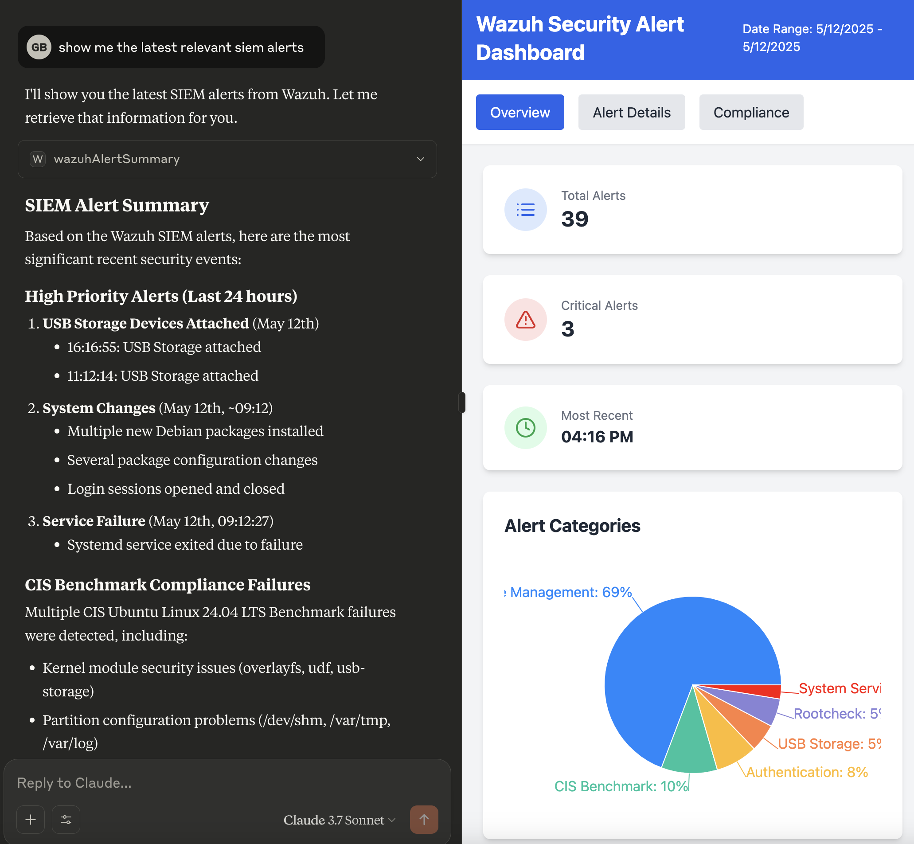
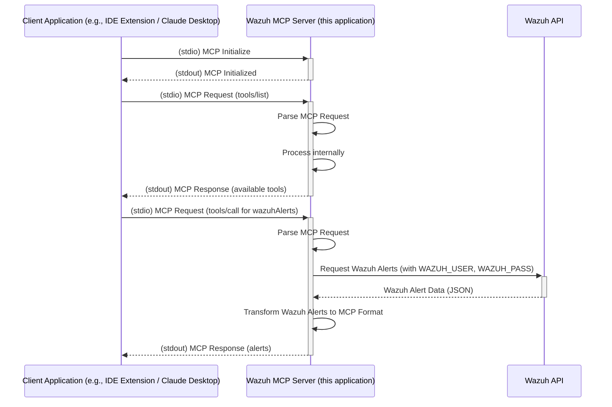

# Wazuh MCP Server

A Rust-based server designed to bridge the gap between a Wazuh Security Information and Event Management (SIEM) system and applications requiring contextual security data, specifically tailored for the Claude Desktop Integration using the Model Context Protocol (MCP).

## Overview

Modern AI assistants like Claude can benefit significantly from real-time context about the user's environment. For security operations, this means providing relevant security alerts and events. Wazuh is a popular open-source SIEM, but its API output isn't directly consumable by systems expecting MCP format.



## Example Use Cases

The Wazuh MCP Server, by bridging Wazuh's security data with MCP-compatible applications, unlocks several powerful use cases:

*   **Delegated Alert Triage:** Automate alert categorization and prioritization via AI, focusing analyst attention on critical events.
*   **Enhanced Alert Correlation:** Enrich alerts by correlating with CVEs, OSINT, and other threat intelligence for deeper context and risk assessment.
*   **Dynamic Security Visualizations:** Generate on-demand reports and visualizations of Wazuh data to answer specific security questions.
*   **Multilingual Security Operations:** Query Wazuh data and receive insights in multiple languages for global team accessibility.
*   **Natural Language Data Interaction:** Query Wazuh data using natural language for intuitive access to security information.
*   **Contextual Augmentation for Other Tools:** Use Wazuh data as context to enrich other MCP-enabled tools and AI assistants.

## Requirements

-   An MCP (Model Context Protocol) compatible LLM client (e.g., Claude Desktop)
-   A running Wazuh server (v4.x recommended) with the API enabled and accessible.
-   Network connectivity between this server and the Wazuh API (if API interaction is used).

## Installation

### Option 1: Download Pre-built Binary (Recommended)

1.  **Download the Binary:**
    *   Go to the [Releases page](https://github.com/gbrigandi/mcp-server-wazuh/releases) of the `mcp-server-wazuh` GitHub repository.
    *   Download the appropriate binary for your operating system (e.g., `mcp-server-wazuh-linux-amd64`, `mcp-server-wazuh-macos-amd64`, `mcp-server-wazuh-windows-amd64.exe`).
    *   Make the downloaded binary executable (e.g., `chmod +x mcp-server-wazuh-linux-amd64`).
    *   (Optional) Rename it to something simpler like `mcp-server-wazuh` and move it to a directory in your system's `PATH` for easier access.

### Option 2: Build from Source

1.  **Prerequisites:**
    *   Install Rust: [https://www.rust-lang.org/tools/install](https://www.rust-lang.org/tools/install)

2.  **Build:**
    ```bash
    git clone https://github.com/gbrigandi/mcp-server-wazuh.git
    cd mcp-server-wazuh
    cargo build --release
    ```
    The binary will be available at `target/release/mcp-server-wazuh`.

### Configure Your LLM Client

The method for configuring your LLM client will vary depending on the client itself. For clients that support MCP (Model Context Protocol), you will typically need to point the client to the path of the `mcp-server-wazuh` executable.

**Example for Claude Desktop:**

Configure your `claude_desktop_config.json` file:

```json
{
  "mcpServers": {
    "wazuh": {
      "command": "/path/to/mcp-server-wazuh",
      "args": [],
      "env": {
        "WAZUH_HOST": "your_wazuh_host",
        "WAZUH_USER": "admin",
        "WAZUH_PASS": "your_wazuh_password",
        "WAZUH_PORT": "9200",
        "VERIFY_SSL": "false",
        "RUST_LOG": "info"
      }
    }
  }
}
```

Replace `/path/to/mcp-server-wazuh` with the actual path to your binary and configure the environment variables as detailed in the [Configuration](#configuration) section.

Once configured, your LLM client should be able to launch and communicate with the `mcp-server-wazuh` to access Wazuh security data.

## Configuration

Configuration is managed through environment variables. A `.env` file can be placed in the project root for local development.

| Variable          | Description                                       | Default     | Required (for API) |
| ----------------- | ------------------------------------------------- | ----------- | ------------------ |
| `WAZUH_HOST`      | Hostname or IP address of the Wazuh API server.   | `localhost` | Yes                |
| `WAZUH_PORT`      | Port number for the Wazuh API.                    | `9200`      | Yes                |
| `WAZUH_USER`      | Username for Wazuh API authentication.            | `admin`     | Yes                |
| `WAZUH_PASS`      | Password for Wazuh API authentication.            | `admin`     | Yes                |
| `VERIFY_SSL`      | Set to `true` to verify the Wazuh API's SSL cert. | `false`     | No                 |
| `MCP_SERVER_PORT` | Port for this MCP server to listen on (if HTTP enabled). | `8000`  | No                 |
| `RUST_LOG`        | Log level (e.g., `info`, `debug`, `trace`).       | `info`      | No                 |

**Note on `VERIFY_SSL`:** For production environments using the Wazuh API, it is strongly recommended to set `VERIFY_SSL=true` and ensure proper certificate validation. Setting it to `false` disables certificate checks, which is insecure.

## Architecture

The server is built using the [rmcp](https://crates.io/crates/rmcp) framework and facilitates communication between MCP clients (e.g., Claude Desktop, IDE extensions) and the Wazuh MCP Server via stdio transport. The server interacts with the Wazuh Indexer API to fetch security alerts and other data.



**Data Flow (stdio focus):**

1.  An application (e.g., an IDE extension, a CLI tool) launches the Wazuh MCP Server as a child process.
2.  The application sends MCP-formatted requests (commands) to the server's `stdin`.
3.  The Wazuh MCP Server reads the command from `stdin`.
4.  **Processing:**
    *   The server parses the MCP command.
    *   If the command requires fetching data from Wazuh (e.g., "get latest alerts"):
        *   The server connects to the Wazuh API (authenticating if necessary using configured credentials like `WAZUH_USER`, `WAZUH_PASS`).
        *   It fetches the required data (e.g., security alerts).
        *   The server's transformation logic (`src/mcp/transform.rs`) processes each alert, mapping Wazuh fields to MCP fields.
    *   If the command is internal (e.g., a status check specific to the MCP server), it processes it directly.
5.  The server sends an MCP-formatted JSON response (e.g., transformed alerts, command acknowledgment, or error messages) to the application via its `stdout`.
6.  The application reads and processes the MCP response from the server's `stdout`.

This stdio interaction allows for tight integration with local development tools or other applications that can manage child processes. An optional HTTP endpoint (`/mcp`) may also be available for clients that prefer polling.


## Building

### Prerequisites

-   Install Rust: [https://www.rust-lang.org/tools/install](https://www.rust-lang.org/tools/install)
-   Install Docker and Docker Compose (optional, for containerized deployment): [https://docs.docker.com/get-docker/](https://docs.docker.com/get-docker/)

### Local Development

1.  **Clone the repository:**
    ```bash
    git clone https://github.com/gbrigandi/mcp-server-wazuh.git 
    cd mcp-server-wazuh
    ```
2.  **Configure (if using Wazuh API):**
    -   Copy the example environment file: `cp .env.example .env`
    -   Edit the `.env` file with your specific Wazuh API details (`WAZUH_HOST`, `WAZUH_PORT`, `WAZUH_USER`, `WAZUH_PASS`).
3.  **Build:**
    ```bash
    cargo build
    ```
4.  **Run:**
    ```bash
    cargo run
    # Or use the run script (which might set up stdio mode):
    # ./run.sh
    ```
    If the HTTP server is enabled, it will start listening on the port specified by `MCP_SERVER_PORT` (default 8000). Otherwise, it will operate in stdio mode.

### Docker Deployment

1.  **Clone the repository** (if not already done).
2.  **Configure:** Ensure you have a `.env` file with your Wazuh credentials in the project root if using the API, or set the environment variables directly in the `docker-compose.yml` or your deployment environment.
3.  **Build and Run:**
    ```bash
    docker-compose up --build -d
    ```
    This will build the Docker image and start the container in detached mode.

## Stdio Mode Operation

The server communicates via `stdin` and `stdout` using JSON-RPC 2.0 messages, adhering to the Model Context Protocol (MCP).

Example interaction flow:

1.  **Client Application (e.g., IDE extension) starts the `mcp-server-wazuh` process.**

2.  **Client sends `initialize` request to server's `stdin`:**
    ```json
    {
      "jsonrpc": "2.0",
      "id": 0,
      "method": "initialize",
      "params": {
        "protocolVersion": "2024-11-05",
        "capabilities": {
          "sampling": {},
          "roots": { "listChanged": true }
        },
        "clientInfo": {
          "name": "mcp-inspector",
          "version": "0.11.0"
        }
      }
    }
    ```

3.  **Server sends `initialize` response to client via `stdout`:**
    (Capabilities shown are illustrative based on logs; actual capabilities might vary.)
    ```json
    {
      "jsonrpc": "2.0",
      "id": 0,
      "result": {
        "protocolVersion": "2024-11-05",
        "capabilities": {
          "tools": {
            "supported": true,
            "definitions": [
              {
                "name": "get_wazuh_alert_summary",
                "description": "Retrieves a summary of Wazuh security alerts. Returns formatted alert information including ID, timestamp, and description.",
                "inputSchema": {
                  "type": "object",
                  "properties": {
                    "limit": {
                      "type": "integer",
                      "description": "Maximum number of alerts to retrieve (default: 100)"
                    }
                  }
                }
              }
            ]
          },
          "resources": { "supported": true },
          "prompts": { "supported": true }
        },
        "serverInfo": {
          "name": "Wazuh MCP Server",
          "version": "0.1.0"
        }
      }
    }
    ```

4.  **Client sends `notifications/initialized` to server's `stdin`:**
    (This is a notification, so `id` is omitted by the client.)
    ```json
    {
      "jsonrpc": "2.0",
      "method": "notifications/initialized"
    }
    ```

5.  **Client requests available tools by sending `tools/list` to server's `stdin`:**
    ```json
    {
      "jsonrpc": "2.0",
      "id": 1,
      "method": "tools/list",
      "params": {}
    }
    ```

6.  **Server responds with the list of tools to client via `stdout`:**
    ```json
    {
      "jsonrpc": "2.0",
      "id": 1,
      "result": {
        "tools": [
          {
            "name": "wazuhAlerts",
            "description": "Retrieves the latest security alerts from the Wazuh SIEM.",
            "inputSchema": { "type": "object", "properties": {} },
            "outputSchema": {
              "type": "object",
              "properties": {
                "alerts": {
                  "type": "array",
                  "description": "A list of simplified alert objects.",
                  "items": {
                    "type": "object",
                    "properties": {
                      "id": { "type": "string", "description": "The unique identifier of the alert." },
                      "description": { "type": "string", "description": "The description of the rule that triggered the alert." }
                    },
                    "required": ["id", "description"]
                  }
                }
              },
              "required": ["alerts"]
            }
          }
        ]
      }
    }
    ```

7.  **Client calls the `wazuhAlerts` tool by sending `tools/call` to server's `stdin`:**
    ```json
    {
      "jsonrpc": "2.0",
      "id": 2,
      "method": "tools/call",
      "params": {
        "name": "wazuhAlerts",
        "arguments": {}
      }
    }
    ```

8.  **Server receives on `stdin`, processes the `wazuhAlerts` call (which involves querying the Wazuh API and transforming the data as described elsewhere in this README).**

9.  **Server sends `tools/call` response with transformed alerts to client via `stdout`:**
    (Alert content is illustrative and simplified.)
    ```json
    {
      "jsonrpc": "2.0",
      "id": 2,
      "result": {
        "alerts": [
          {
            "id": "1747091815.1212763",
            "description": "Attached USB Storage"
          },
          {
            "id": "1747066333.1207112",
            "description": "New dpkg (Debian Package) installed."
          }
          // ... other simplified alerts based on the tool's outputSchema
        ]
      }
    }

## Running the All-in-One Demo (Wazuh + MCP Server)

For a complete local demo environment that includes Wazuh (Indexer, Manager, Dashboard) and the Wazuh MCP Server pre-configured to connect to it (for HTTP mode testing), you can use the `docker-compose.all-in-one.yml` file.

This setup is ideal for testing the end-to-end flow from Wazuh alerts to MCP messages via the HTTP interface.

**1. Launch the Environment:**

Navigate to the project root directory in your terminal and run:

```bash
docker-compose -f docker-compose.all-in-one.yml up -d
```

This command will:
- Download the necessary Wazuh and OpenSearch images (if not already present).
- Start the Wazuh Indexer, Wazuh Manager, and Wazuh Dashboard services.
- Build and start the Wazuh MCP Server (in HTTP mode).
- All services are configured to communicate with each other on an internal Docker network.

**2. Accessing Services:**

*   **Wazuh Dashboard:**
    *   URL: `https://localhost:8443` (Note: Uses HTTPS with a self-signed certificate, so your browser will likely show a warning).
    *   Default Username: `admin`
    *   Default Password: `AdminPassword123!` (This is set by `WAZUH_INITIAL_PASSWORD` in the `wazuh-indexer` service).

*   **Wazuh MCP Server (HTTP Mode):**
    *   The MCP server will be running and accessible on port `8000` by default (or the port specified by `MCP_SERVER_PORT` if you've set it as an environment variable on your host machine before running docker-compose).
    *   Example MCP endpoint: `http://localhost:8000/mcp`
    *   Example Health endpoint: `http://localhost:8000/health`
    *   **Configuration:** The `mcp-server` service within `docker-compose.all-in-one.yml` is already configured with the necessary environment variables to connect to the `wazuh-manager` service:
        *   `WAZUH_HOST=wazuh-manager`
        *   `WAZUH_PORT=55000`
        *   `WAZUH_USER=wazuh_user_demo`
        *   `WAZUH_PASS=wazuh_password_demo`
        *   `VERIFY_SSL=false`
        You do not need to set these in a separate `.env` file when using this all-in-one compose file, as they are defined directly in the service's environment.

**3. Stopping the Environment:**

To stop all services, run:

```bash
docker-compose -f docker-compose.all-in-one.yml down
```

To stop and remove volumes (deleting Wazuh data):

```bash
docker-compose -f docker-compose.all-in-one.yml down -v
```
This approach simplifies setup by bundling all necessary components and their configurations for HTTP mode testing.

## Development & Testing

-   **Code Style:** Uses standard Rust formatting (`cargo fmt`).
-   **Linting:** Uses Clippy (`cargo clippy`).
-   **Testing:** Contains unit tests for transformation logic and integration tests. For stdio, tests might involve piping input/output to a test harness. For HTTP, tests use a mock Wazuh API server (`httpmock`) and a test MCP client.
    ```bash
    # Run all tests
    cargo test

    # Run specific integration test (example for HTTP tests)
    # cargo test --test integration_test

    # Run tests with detailed logging
    RUST_LOG=debug cargo test
    ```
-   See `tests/README.md` for more details on running tests and using the test client CLI.

## License

This project is licensed under the [MIT License](LICENSE).

